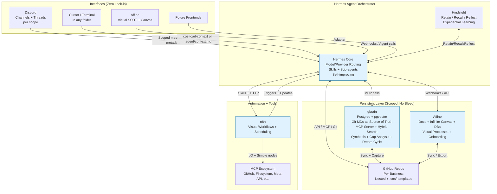

# COS High-Level Architecture

## Mermaid Diagram

## Data Flows (Key)
- Context load (any interface) → Hermes → scoped gbrain `think`/search + Hindsight recall + local MDs → synthesized efficient chunk → back to interface or `.agent/context.md`
- Task/automation → Hermes (scope-aware) → tools/MCP (Meta, git, gbrain write) → updates to Git + gbrain + Affine → Hindsight reflect
- Nightly: gbrain dream cycle (enrichment, dedup) + Hermes scheduled jobs

## Integration Summary
**Hermes + gbrain + Hindsight** form the central persistent intelligence layer with perfect scoping (no context bleed between businesses/clients/projects).

See full proposal for detailed integration mechanics.